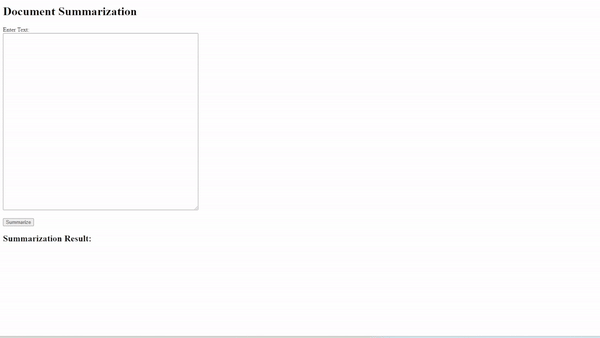

# Document Summarization API

## Overview
The Document Summarization API provides a simple interface to summarize text documents using Azure Text Analytics. The API supports extracting key sentences from input text. The Document Summarization App uses the Azure Text Analytics service for text summarization. Users authenticate themselves by providing the API key and the service endpoint. The API key is included in the request headers for each API call made by the app to the Text Analytics service. Users should securely store their API key and avoid sharing it publicly.


## Prerequisites
**1. API Key**:
- Before using the Document Summarization App, developers need to obtain an API key. This key is required for authenticating and accessing the Azure Text Analytics service, which powers the summarization functionality.
- The API key should be kept secure, as it serves as a unique identifier and is required for making requests to the underlying API.

**2. Text Analytics Service Endpoint**:
Users should have access to the endpoint URL of the Azure Text Analytics service. This is the URL where the service is hosted and can be reached.

**3. Web Browser**:
To interact with the app's user interface, users need a web browser. The app is designed to be accessible via standard web browsers.

**4. Create Environment Variables**:
Your application must be authenticated to send API requests. For production, use a secure way of storing and accessing your credentials. In this example, you will write your credentials to environment variables on the local machine running the application.
1. To set the LANGUAGE_KEY environment variable, replace your-key with one of the keys for your resource.
2. To set the LANGUAGE_ENDPOINT environment variable, replace your-endpoint with the endpoint for your resource.

#### Windows
```
setx LANGUAGE_KEY your-key
```
```
setx LANGUAGE_ENDPOINT your-endpoint
```

#### MacOS
```
export LANGUAGE_KEY=your-key
```
```
export LANGUAGE_ENDPOINT=your-endpoint
```

**5. Install the client library**:
After installing Python, you can install the client library with:
```
pip install azure-ai-textanalytics==5.3.0
```

## Azure API Key and Endpoint
**1. Azure AI Language Portal**:
- Users can obtain the API key and endpoint by creating an account on the Azure AI Language Portal (https://azure.microsoft.com/en-us/products/ai-services/ai-language/).
- Once logged in, they can create a "Language service" resource and retrieve the API key and endpoint from the resource's configuration.

**2. Azure Cognitive Services Subscription**:
- The Document Summarization App requires a subscription to Azure Cognitive Services, specifically the Text Analytics service.
- Users can subscribe to Text Analytics through the Azure Portal and obtain the necessary credentials.

## Base URL
The base URL for the API is https://your-api-domain.com.

## Authentication
The API requires an API key for authentication. Include the API key in the headers of your requests using the Ocp-Apim-Subscription-Key header.

## Endpoints
**1. GET /**:
- **Description**: This endpoint serves the main interface of the Document Summarization App. Users can access this endpoint through a web browser to input text and initiate the summarization process. This endpoint is the entry point for users interacting with the app. They can visit the root URL to access the app's user interface and easily input the text they want to be summarized.
- **Request**:
  - Method: GET
- **Response**: The HTML content for the app homepage, including a text area for user input and a button to trigger text summarization.

**2. POST /summarize**:
- **Description**: This endpoint is responsible for handling the summarization process. It expects a JSON payload containing the text to be summarized.
- **Request**:
  - Method: POST
  - Headers:
    - Content-Type: application/json
  - Body:
```
{
    "documents": [
        {
            "id": "1",
            "language": "en",
            "text": "Your input text goes here."
        }
    ]
}
```
- **Response**: A JSON response containing the summarization result.
```
{
    "results": [
        {
            "id": "1",
            "language": "en",
            "summary": "The summarized text goes here."
        }
    ]
}
```
## Postman
To test this application via Postman, a user must first have Postman installed. Next, a user can test the POST and GET requests of the REST API. To test the POST data, a user must go to the "Body" tab and utilize the following format to summarize their text.
```
{
    "documents": [
        {
            "id": "1",
            "language": "en",
            "text": "Your input text goes here."
        }
    ]
}
```


To test the GET data, a user can utilize the link of their asset to receive the status code 200 to reflect that the application is working.


## Error Handling
The API returns appropriate HTTP status codes and error messages. If an error happens, please take a look at the error field in the response for details.
#### Format
```
{
  "error": {
    "code": "Error-Code",
    "message": "Error message details."
  }
}
```
#### Example
```
Code: InvalidRequest
Message: Invalid Document in request.
Inner error: {
    "code": "InvalidDocumentBatch",
    "message": "Document text is empty."
}
```

### Status Codes
- 200 OK: Successful response.
- 400 Bad Request: Malformed request or invalid parameters.
- 401 Unauthorized: Missing or invalid API key.
- 429 Too Many Requests: Exceeded rate limit.
